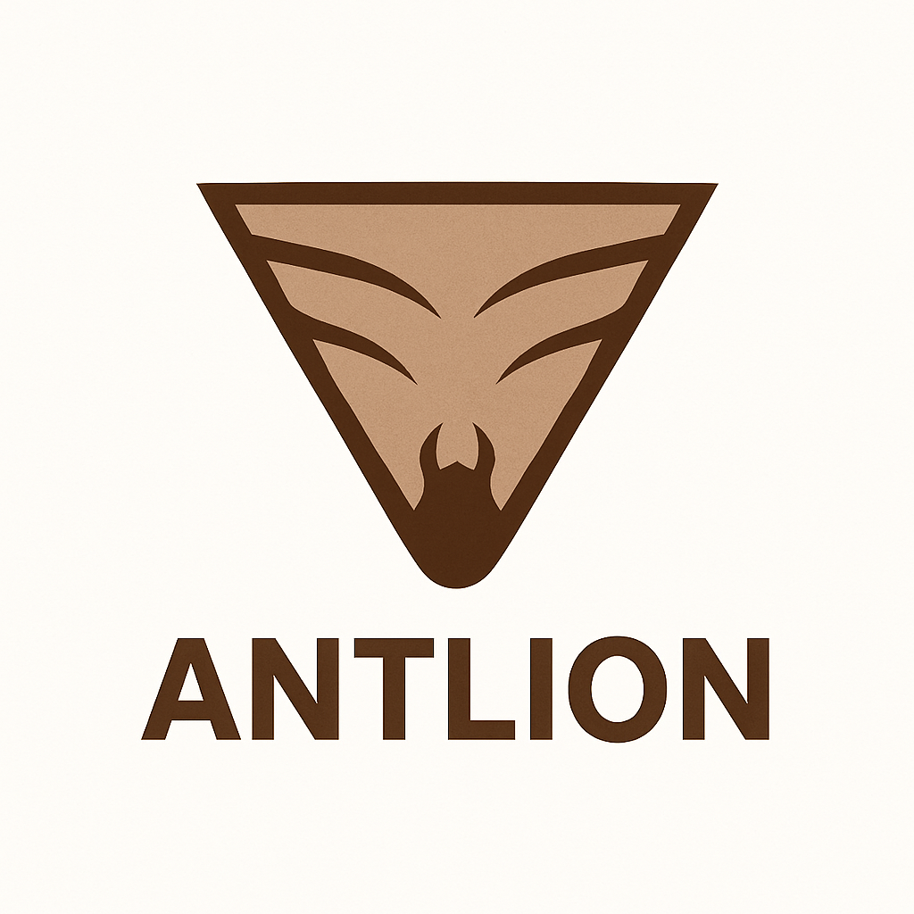

<a id="readme-top"></a>


[![Contributors][contributors-shield]][contributors-url]
[![Forks][forks-shield]][forks-url]
[![Stargazers][stars-shield]][stars-url]
[![Issues][issues-shield]][issues-url]
[![project_license][license-shield]][license-url]
[![LinkedIn][linkedin-shield]][linkedin-url]


<!-- PROJECT LOGO -->
<br />
<div align="center">
  <a href="#">
    
  </a>

  <div id="user-content-toc">
    <ul align="center" style="list-style: none;">
      <summary>
        <h1><strong>Antlion</strong></h1>
          <div />
        <h3 align="center">
          <i>Make yourself indigestible, grow spikes.</i>
        </h3>
      </summary>
    </ul>
  </div>
</div>

<br />

<!-- TABLE OF CONTENTS -->
<details>
  <summary>Table of Contents</summary>
  <ol>
    <li>
      <a href="#about-the-project">About The Project</a>
      <ul>
        <li><a href="#built-with">Built With</a></li>
      </ul>
    </li>
    <li>
      <a href="#getting-started">Getting Started</a>
      <ul>
        <li><a href="#prerequisites">Prerequisites</a></li>
        <li><a href="#installation">Installation</a></li>
      </ul>
    </li>
    <li><a href="#usage">Usage</a></li>
    <li><a href="#roadmap">Roadmap</a></li>
    <li><a href="#contributing">Contributing</a></li>
    <li><a href="#license">License</a></li>
    <li><a href="#contact">Contact</a></li>
    <li><a href="#acknowledgments">Acknowledgments</a></li>
  </ol>
</details>


<!-- ABOUT THE PROJECT -->
## About The Project

For too long, AI companies have been flagrantly disrespecting website owners by ignoring their robots.txt and scraping everything on their site without permission. _**Antlion** gives you the power to fight back._

**Antlion** is Express.js middleware that gives you the ability to set up dedicated routes on your site to become become infinitely recursive tar pits designed to trap webscrapers that ignore your `robots.txt` file. 

- When malicious bots enter **Antlion**'s pit, they become locked in an infinitely deep site. Every child route of the trapped routes becomes a new randomly generated page of nonsense text (generated with a Markov Babbler), which loads at speeds comparable to a 1990's dial up connection. Once the bot waits for the text to finally load, they are presented with several links, each of which leads to another near-identical page with more junk data. 

- Because most webscrapers are designed to recursively traverse an entire site, the become trapped an indefinite state of waiting and clicking links.

- Best of all, _the data they collect actively poisons any LLM datasets._

- **Antlion** also automatically manages your robots.txt, adding disallow entries for all trapped routes to ensure ethical bots and search engine indexers are not affected.

- Adding **Antlion** to your site is incredibly easy, just install the npm package, give it some unused routes, point it to your existing `robots.txt`, and add a single hidden link somewhere on your site that leads into the pit. _**Antlion** will take care of the rest_.

<p align="right">(<a href="#readme-top">back to top</a>)</p>
<br />


### Built With

- [![Node.js][Node.js]][Node-url]
- [![Express.js][Express.js]][Express-url]
- [![TypeScript][TypeScript]][TypeScript-url]

<br />


<!-- GETTING STARTED -->
## Getting Started

This is an example of how you may give instructions on setting up your project locally.
To get a local copy up and running follow these simple example steps.

### Prerequisites

This is an example of how to list things you need to use the software and how to install them.
* npm
  ```sh
  npm install npm@latest -g
  ```

### Installation

1. Get a free API Key at [https://example.com](https://example.com)
2. Clone the repo
   ```sh
   git clone https://github.com/github_username/repo_name.git
   ```
3. Install NPM packages
   ```sh
   npm install
   ```
4. Enter your API in `config.js`
   ```js
   const API_KEY = 'ENTER YOUR API';
   ```
5. Change git remote url to avoid accidental pushes to base project
   ```sh
   git remote set-url origin github_username/repo_name
   git remote -v # confirm the changes
   ```

<p align="right">(<a href="#readme-top">back to top</a>)</p>


<!-- USAGE EXAMPLES -->
## Usage

Use this space to show useful examples of how a project can be used. Additional screenshots, code examples and demos work well in this space. You may also link to more resources.

_For more examples, please refer to the [Documentation](https://example.com)_

<p align="right">(<a href="#readme-top">back to top</a>)</p>


<!-- ROADMAP -->
## Roadmap

- [ ] Feature 1
- [ ] Feature 2
- [ ] Feature 3
    - [ ] Nested Feature

See the [open issues](https://github.com/shsiena/Antlion/issues) for a full list of proposed features (and known issues).

<p align="right">(<a href="#readme-top">back to top</a>)</p>


<!-- CONTRIBUTING -->
## Contributing

Contributions are what make the open source community such an amazing place to learn, inspire, and create. Any contributions you make are **greatly appreciated**.

If you have a suggestion that would make this better, please fork the repo and create a pull request. You can also simply open an issue with the tag "enhancement".
Don't forget to give the project a star! Thanks again!

1. Fork the Project
2. Create your Feature Branch (`git checkout -b feature/AmazingFeature`)
3. Commit your Changes (`git commit -m 'Add some AmazingFeature'`)
4. Push to the Branch (`git push origin feature/AmazingFeature`)
5. Open a Pull Request

<p align="right">(<a href="#readme-top">back to top</a>)</p>

### Top contributors:

<a href="https://github.com/shsiena/Antlion/graphs/contributors">
  
</a>


<!-- LICENSE -->
## License

Distributed under the project_license. See `LICENSE.txt` for more information.

<p align="right">(<a href="#readme-top">back to top</a>)</p>


<!-- CONTACT -->
## Contact

Simon Siena - ssiena@uwaterloo.ca

Project Link: [https://github.com/shsiena/Antlion](https://github.com/shsiena/Antlion)

<p align="right">(<a href="#readme-top">back to top</a>)</p>


<!-- ACKNOWLEDGMENTS -->
## Acknowledgments

* []()
* []()
* []()

<p align="right">(<a href="#readme-top">back to top</a>)</p>


<!-- MARKDOWN LINKS & IMAGES -->
<!-- https://www.markdownguide.org/basic-syntax/#reference-style-links -->
[contributors-shield]: https://img.shields.io/github/contributors/shsiena/Antlion.svg?style=for-the-badge
[contributors-url]: https://github.com/shsiena/Antlion/graphs/contributors
[forks-shield]: https://img.shields.io/github/forks/shsiena/Antlion.svg?style=for-the-badge
[forks-url]: https://github.com/shsiena/Antlion/network/members
[stars-shield]: https://img.shields.io/github/stars/shsiena/Antlion.svg?style=for-the-badge
[stars-url]: https://github.com/shsiena/Antlion/stargazers
[issues-shield]: https://img.shields.io/github/issues/shsiena/Antlion.svg?style=for-the-badge
[issues-url]: https://github.com/shsiena/Antlion/issues
[license-shield]: https://img.shields.io/github/license/shsiena/Antlion.svg?style=for-the-badge
[license-url]: https://github.com/shsiena/Antlion/blob/master/LICENSE.txt
[linkedin-shield]: https://img.shields.io/badge/-LinkedIn-black.svg?style=for-the-badge&logo=linkedin&colorB=555
[linkedin-url]: https://linkedin.com/in/linkedin_username
[product-screenshot]: images/screenshot.png
[Node.js]: https://img.shields.io/badge/Node.js-5FA04E?style=for-the-badge&logo=nodedotjs&logoColor=white
[Node-url]: https://nodejs.org/en
[Express.js]: https://img.shields.io/badge/Express-090a0a?style=for-the-badge&logo=express&logoColor=white
[Express-url]: https://https://expressjs.com
[TypeScript]: https://img.shields.io/badge/TypeScript-3178C6?style=for-the-badge&logo=typescript&logoColor=white
[TypeScript-url]: https://www.typescriptlang.org/
