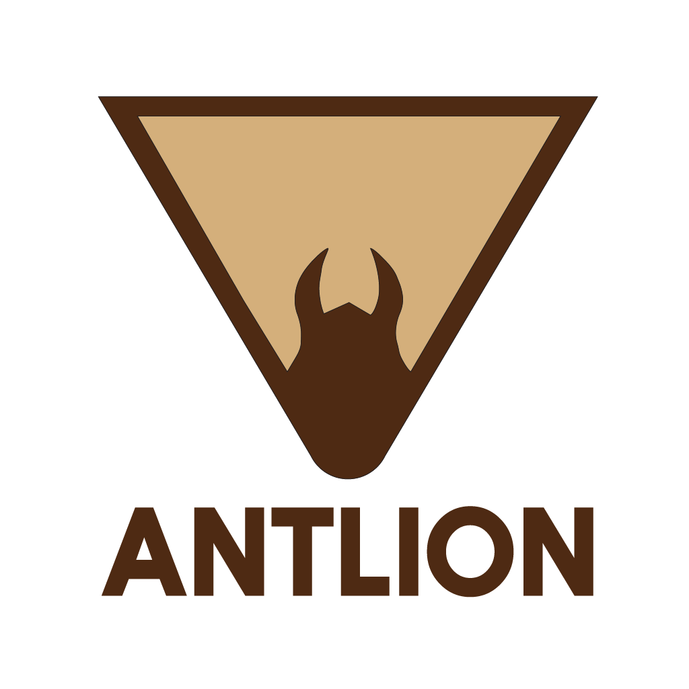

<a id="readme-top"></a>

<!--
[![Contributors][contributors-shield]][contributors-url]
[![Forks][forks-shield]][forks-url]
[![Stargazers][stars-shield]][stars-url]
[![Issues][issues-shield]][issues-url]
[![project_license][license-shield]][license-url]
[![LinkedIn][linkedin-shield]][linkedin-url]
-->


<!-- PROJECT LOGO -->
<br />
<div align="center">
  <div id="user-content-toc">
    <ul align="center" style="list-style: none;">
          
          <h3 align="center" style="margin-top: -10px;">
            <i>Become indigestible, grow spikes.</i>
          </h3>
<div align="center">
  
  [![Node.js][Node.js]][Node-url]
  [![Express.js][Express.js]][Express-url]
  [![TypeScript][TypeScript]][TypeScript-url]
</div>
        <a href="https://github.com/github_username/repo_name/issues/new?labels=bug&template=bug-report---.md">Report Bug </a>
          ·
        <a href="https://github.com/github_username/repo_name/issues/new?labels=enhancement&template=feature-request---.md"> Request Feature</a>
    </ul>
  </div>
</div>


<!-- TABLE OF CONTENTS -->
<details>
  <summary>Table of Contents</summary>
  <ol>
    <li>
      <a href="#about-the-project">About The Project</a>
    </li>
    <li>
      <a href="#installation">Installation</a>
    </li>
    <li><a href="#usage">Usage</a></li>
    <li><a href="#roadmap">Roadmap</a></li>
    <li><a href="#contributing">Contributing</a></li>
    <li><a href="#license">License</a></li>
    <li><a href="#contact">Contact</a></li>
    <li><a href="#acknowledgments">Acknowledgments</a></li>
  </ol>
</details>


<!-- ABOUT THE PROJECT -->
## About The Project
<!--
<div align="left">

[![NPM Version][npm-version-image]][npm-url]
[![NPM Downloads][npm-downloads-image]][npm-downloads-url]
</div>
-->

For too long, AI companies have been flagrantly disrespecting website owners by ignoring their robots.txt and scraping everything on their site without permission. _With **Antlion**, you can fight back._

**Antlion** is Express.js middleware that gives you the ability to set up dedicated routes on your site to become infinitely recursive tar pits designed to trap webscrapers that ignore your `robots.txt` file. 


### Features
- Bots that ignore your site's `robots.txt` and enter **Antlion**'s pit are locked in an infinitely deep site full of nonsensical garbled text which loads at the speed of a '90s dial-up connection.
- Once bots wait upwards of 20 seconds for a page to finally load, they are presented with several links, each of which leads deeper into **Antlion**'s pit. 

- **Antlion** also automatically handles your robots.txt, adding disallow entries for all trapped routes to ensure ethical bots and search engine indexers are not affected without any additional overhead.

- Any malicious webscrapers gathering data to compile datasets for training LLMs will inadvertently digest millions of lines of useless text, ruining the output of models trained with this data, ideally making bot owners think twice before ignoring the rules in your sacred `robots.txt`.

- Adding **Antlion** to your site is incredibly easy, just install the npm package, give it some unused routes, point it to your existing `robots.txt`, and add a single hidden link somewhere on your site that leads into the pit. _**Antlion** will take care of the rest_.

<p align="right">(<a href="#readme-top">back to top</a>)</p>
<br />


<details>
<summary><strong>Screenshot</strong></summary>

</details>


## Installation

This is a [Node.js](https://nodejs.org/en/) module available through the
[npm registry](https://www.npmjs.com/).

Before installing, [download and install Node.js](https://nodejs.org/en/download/).
Node.js 18 or higher is required.

If this is a brand new project, make sure to create a `package.json` first with
the [`npm init` command](https://docs.npmjs.com/creating-a-package-json-file).

Installation is done using the
[`npm install` command](https://docs.npmjs.com/getting-started/installing-npm-packages-locally):

```bash
npm install antlion
```
<p align="right">(<a href="#readme-top">back to top</a>)</p>


<!-- USAGE EXAMPLES -->
## Usage

1. Create a file `training-data.txt`, and fill it with as much text as you can. This can be Wikipedia articles, blog posts, textbooks, or even Shakespeare. _Do not worry about formatting or special characters._

3. Choose a couple routes that you are not/do not plan on using, such as `/blog/`, `/docs/installation/` or `/aboutus/detailed/`. These can be anything, but the more realistic they are, the better.

4. Remove any existing handlers for `/robots.txt`.

5. Import Antlion and add it to your server middleware:
```js
import express from 'express'
import antlion from 'antlion'

const app = express()

antlion(app, {
    robotsPath: 'robots.txt',                 // path to your existing robots.txt from your project root
    trainingDataPath: 'training-data.txt',    // path to your training data file from project root
    trappedRoutes: ['/example/', '/trap/']    // array of the routes to trap
})

// -- rest of your code --
```

6. Hide a link into **Antlion**'s pit somewhere on your site, ideally hidden so regular users will not notice it.
   - This trapped link should be one of the trapped routes, optionally followed by random text.
   - Ex: `/trap/abcdef`, or just `/trap`

_NOTE: To avoid strain on your server, Antlion can be installed on another webserver, and linked to from your main site._


<p align="right">(<a href="#readme-top">back to top</a>)</p>


<!-- ROADMAP -->
## Roadmap

- [ ] Dynamic HTML to evade detection
- [ ] Bot IP address tracking/logging
- [ ] Text generation model caching for faster startup

See the [open issues](https://github.com/shsiena/antlion/issues) for a full list of proposed features (and known issues).

<p align="right">(<a href="#readme-top">back to top</a>)</p>


<!-- CONTRIBUTING -->
## Contributing

Contributions are what make the open source community such an amazing place to learn, inspire, and create. Any contributions you make are **greatly appreciated**.

### Setup
Clone the repository:
```bash
git clone https://github.com/shsiena/antlion.git
```

Install dependencies:
```bash
cd antlion
npm install
```

Run test server:
```bash
npm run dev
```

If you have a suggestion that would make this better, please fork the repo and create a pull request. You can also simply open an issue with the tag "enhancement".
Don't forget to give the project a star! Thanks again!

1. Fork the Project
2. Create your Feature Branch (`git checkout -b feature/AmazingFeature`)
3. Commit your Changes (`git commit -m 'Add some AmazingFeature'`)
4. Push to the Branch (`git push origin feature/AmazingFeature`)
5. Open a Pull Request

<p align="right">(<a href="#readme-top">back to top</a>)</p>

<!--
### Top contributors:

<a href="https://github.com/shsiena/antlion/graphs/contributors">
  
</a>
-->


<!-- LICENSE -->
## License

Distributed under the MIT licence. See `LICENSE` for more information.

<p align="right">(<a href="#readme-top">back to top</a>)</p>


<!-- CONTACT -->
## Contact

Simon Siena - ssiena@uwaterloo.ca

Project Link: [https://github.com/shsiena/antlion](https://github.com/shsiena/antlion)

<p align="right">(<a href="#readme-top">back to top</a>)</p>


<!-- ACKNOWLEDGMENTS -->
## Acknowledgments

* Inspired by:
  -  [Nepenthes](https://zadzmo.org/code/nepenthes) - "Aaron B." (pseudonym)
  -  [Nightshade](https://nightshade.cs.uchicago.edu/whatis.html) - [@TheGlazeProject](https://twitter.com/theglazeproject)

<p align="right">(<a href="#readme-top">back to top</a>)</p>


<!-- MARKDOWN LINKS & IMAGES -->
<!-- https://www.markdownguide.org/basic-syntax/#reference-style-links -->
[contributors-shield]: https://img.shields.io/github/contributors/shsiena/antlion.svg?style=for-the-badge
[contributors-url]: https://github.com/shsiena/antlion/graphs/contributors
[forks-shield]: https://img.shields.io/github/forks/shsiena/antlion.svg?style=for-the-badge
[forks-url]: https://github.com/shsiena/antlion/network/members
[stars-shield]: https://img.shields.io/github/stars/shsiena/antlion.svg?style=for-the-badge
[stars-url]: https://github.com/shsiena/antlion/stargazers
[issues-shield]: https://img.shields.io/github/issues/shsiena/antlion.svg?style=for-the-badge
[issues-url]: https://github.com/shsiena/antlion/issues
[license-shield]: https://img.shields.io/github/license/shsiena/antlion.svg?style=for-the-badge
[license-url]: https://github.com/shsiena/antlion/blob/master/LICENSE.txt
[linkedin-shield]: https://img.shields.io/badge/-LinkedIn-black.svg?style=for-the-badge&logo=linkedin&colorB=555
[linkedin-url]: https://linkedin.com/in/linkedin_username
[product-screenshot]: images/screenshot.png
[Node.js]: https://img.shields.io/badge/Node-5FA04E?style=for-the-badge&logo=nodedotjs&logoColor=white
[Node-url]: https://nodejs.org/en
[Express.js]: https://img.shields.io/badge/Express-090a0a?style=for-the-badge&logo=express&logoColor=white
[Express-url]: https://https://expressjs.com
[TypeScript]: https://img.shields.io/badge/TypeScript-3178C6?style=for-the-badge&logo=typescript&logoColor=white
[TypeScript-url]: https://www.typescriptlang.org/

[npm-downloads-image]: https://badgen.net/npm/dm/antlion
[npm-downloads-url]: https://npmcharts.com/compare/antlion?minimal=true
[npm-url]: https://npmjs.org/package/antlion
[npm-version-image]: https://badgen.net/npm/v/antlion
